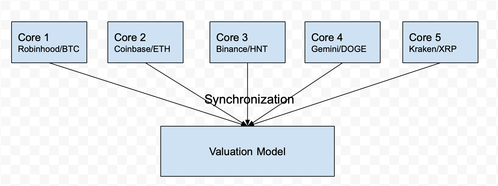

# High Frequency Parallel Crypto Streaming and Valuation

## Summary
We aim to parallelize the streaming and valuation of various cryptocurrencies across a number of cloud hosted exchanges.

## Background
Our application is High-frequency trading(HFT), which is a trading method that relies heavily on highly optimized computer algorithms and hardware components such as ASICs(Application Specific Integrated Circuits)/FPGA(Field Programmable Gate Arrays). Instead of having real traders who manually calculate the price to buy or sell at the exchange floor, proprietary trading firms such as IMC Trading, Citdel Security and Jump trading spend a lot of resources and hire the best engineers in order to analyze multiple market conditions and execute a large amount of order within fractions of seconds. This is only acheivable through highly customized algorithms and hardware that minimize the latency across all stacks, from using high speed network swithches to get assets information from exchanges to valuation model based on ML/AI. 

For our project, we want to focus on the software side of HFT, specifically on parallelizing getting asset information from multiple exchanges and then feed it into valuation model in order to reduce the latency of streaming the data and executing on it. For example, if we want to gather information specifically on prices of Bitcoin from Robinhood, CoinBase, and Binace, a sequential version of the algorithm will have to get the prices of Bitcoin one by one from each exchange. Then after that, we will have to feed these information we gathered into a valuation model which would also execute one after the other. By parallelizing this entire flow, we are able to not only get way more asset information, but also execute more order in much less time. This is important because the principle of HFT is to execute a large amount of orders within a fraction of a second. Just to add on a fun anecdote: one of our group member took a class taught by Professor James Hoe in the ECE department, and he mentioned that one of the trading firms chosed to use FPGAs from Xilinx instead Altera simply due to the fact that the data transfer delay of the latter one is roughly 50 ns worse. This anecdote implies that even a delay on the nanosecond scale can cost these firms millions of dollars, which is why the latency is so important, and for the purpose of this project, latency is exactly what we are going to tackle.

Below is an block diagram of what 75% of our goal will look like

## Challenge
The project is challenging due to the number of different axix's of parallelism available. It is further enhanced due to some aspects that we will need to learn more about as we go about implementing our solution. For starters, some axis' of parallelism are across exchanges, across asset classes, and across running valuation models per asset class. Some of these may need more computation resources than others. For example, the streaming of asset information from a given exchange can be given a core per, but perhaps the actual valuation model for a given asset may need more computation resources than the former. These are problems that we have considered to begin with, but will need to experiment heavily to find the best speedup.

Further, there are a number of different constraints, especially given the fact that we are in the high frequency trading space. We will need to consider optimizations not typically performed in real world examples of software, due to the fact that time constraints pose a hard cutoff. If we cannot process a new piece of market data before the next one comes in, it is essentially useless to us. It is like cracking the enigma machine right after the code has switched. Not only that, but different exchanges may have different latencies, causing our internal valuation model to interact differently depending on the exchange. This could further lead to unique optimizations given what we discover about the markets.

Not only that, but some exchange API's may offer a streaming API, whereas others may offer a pub-sub or polling model. This will further pose challenges and cause us to reconsider some of our parallel approaches as need be.

## Resources
We aim to connect to a number of different popular exchange API's, such as Coinbase, Binance, Pyth network, Coin, etc. While these have resources available, they will all be different, and therefore will pose even more unique constraints and have their own setup costs. We aim and would prefer to code in c++, though may have to consider go depending on how widely available client libraries are.

Further, we aim to use machines with 32-64 cores available, such as some GHC machines, and PSC machines we used throughout the semester.

Besides for the API's and machines, we do not have much other reference except for internship experience in the HFT space, though not directly with crypto.

## Goals and Deliverables
There are a number of different milestones that are applicable for our project.

### 75 %
We aim to be connected to at least 5 exchanges, streaming at least 1 asset from each exchange. The information from these exchanges will feed into one unified valuation model. Synchronization will need to be performed here as necessary.

Further, we will want to have experimented with a number of different parallelization approaches beyond our baseline linear code, and have chosen the best speedup to continue experimenting with further.

### 100 %
We aim to be connected to at least 5 exchanges, streaming at lesat 5 assets from each exchange. This will require parallelism along both axis', probably splitting up each exchage + asset pair into their own core. Further, each asset will have their own valuation service running on a separate core, with concurrency/synchronization as necessary for the API streaming cores to send their information to this other core.

Here, we will need to experiment more heavily with the communication/message passing amongst cores to pass market data to the correct computation core. Further, we will need to experiment with paralellization strategies amongst the core(s) performing the actual valuation model.

### 125 %
We aim to connect to many more exchanges + asset pairs, increasing the number of cores + resources utilized and performance at the same time. Further, we would like to improve valuation model engine, and perform larger degrees of parallelism along this axis as we increase the complexity of the valuation models.

### Overall
Overall, we aim to experiment with a number of different parallelization approaches given the different axis' of parallelism and actual problem constraints. Further, we aim to publish speedup graphs for different strategies, and justify chosen candidates for further experimentation.

## Platform Choice
We believe c++ or go will be the most effective, in combination with our platform with a large number of CPUs seeing as we aim to heavily utilize independent cores for their own respective computations. Further, lots of these operations will be io intensive such as streaming information, and will therefore be less suited to a GPU architecture for example.

## Updated Schedule

### Week 3
Continue improving valuation model computational cost. Further solidify message passing appraoch between streaming nodes and computation nodes.

### Week 4
Scale the problem size on a number of axis', from number of exchanges, to number of assets, to market depth, to valuation model computational cost. Continue to do so until we can show a significant relative speedup/sustained throughput

### Week 5
Continue previous efforts, and create various plots and graphs to show the achieved speedup/throughput gains. Experiment with other parallelization approaches such as per exchange streaming cores versus exchange/asset pairs.

## Milestone

### Work Completed
So far, we have completed a majority of the parallel streaming of asset information work, past the 125% mark we were looking to achieve. We have setup our parallel streaming infrastructure to currently stream 2 assets from 8 different exchanges. This has lent itself to to a parallel model utilizing 16 cores, each streaming an exchange asset pair. Not only that, but we are in a position to scale the number of exchanges and cryptocurrencies to ~20 and >50 respectively. Even further, we can scale the level of market data depth we consume, giving us a more accurate view of the market, but also more data to compute on. This new goal is feasible given our infstracture, and will help scale the problem size so that we can see larger advantages from parallelism. We also did some experimentation work with the actual throughput from each exchange/asset pair, and found the average throughput of market data updates was one update every 3.125 ms. As we continue to scale the problem size to the aforementioned ~20 exchanges and >50 assets, this could push our theoretical required throughput to 3.125 microseconds. We will need to ensure that the sequential implementation and respective valuation model cost is not able to support this sustained throughput, in order to show the benefits of parallelism and overall success of the project.

Further, we have been working on our initial valuation model, beginning with a volume weighted average price model. This is computed within each exchange + cryptocurrency pair, and is then aggregated by another thread to provide an consistent internal oracle of the current price of the curreny. This is similar to the Pyth network, alowing us to coalesce market data from a number of exchanges into one internal view. There are still some parallel aspects in this regard that we aim to solve, such as the synchronization and passing of information from the streaming cores to the compute cores. Further, we aim to increase the computation required for the valuation/aggregation models in order to further scale the problem size.

### Deliverables

We are confident in being able to produce all of our deliverables, and if anything, we believe to exceed the problem/solution size originally anticipated, as mentioned above.

### Poster Session

We plan to show the architecture of our solution, both the streaming aspect and message passing/aggregation of the various valuation models. We will also showcase any parallelism required within the valuation/aggregation model itself. We aim to show graphs of the relative speedup and increase in throughput by parallelizing along the various exchanges/cryptocurrencies. 

### Concerns
We have no major concerns at this point in time. One concern that we discussed with Professor Beckmann was the problem size and actual need for parallization. However, given the work we have conducted so far we are confident in surpassing this for a number of reasons. For one, we are at a good spot to scale up the problem size by a signficant amount in terms of the number of exchanges and assets we will compute on. Further, we have defined various extensions to the valuation model in order for it to perform more computation.
